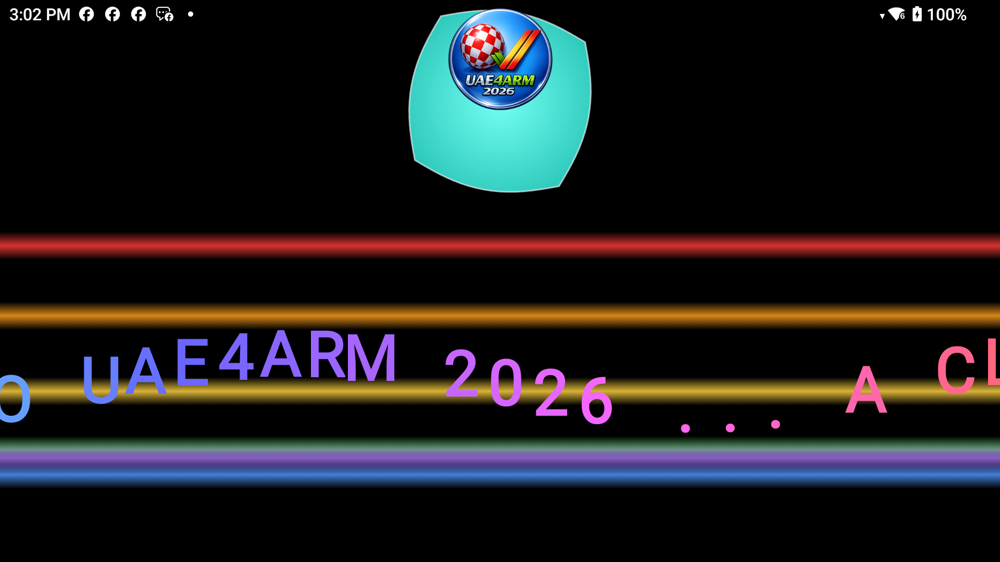
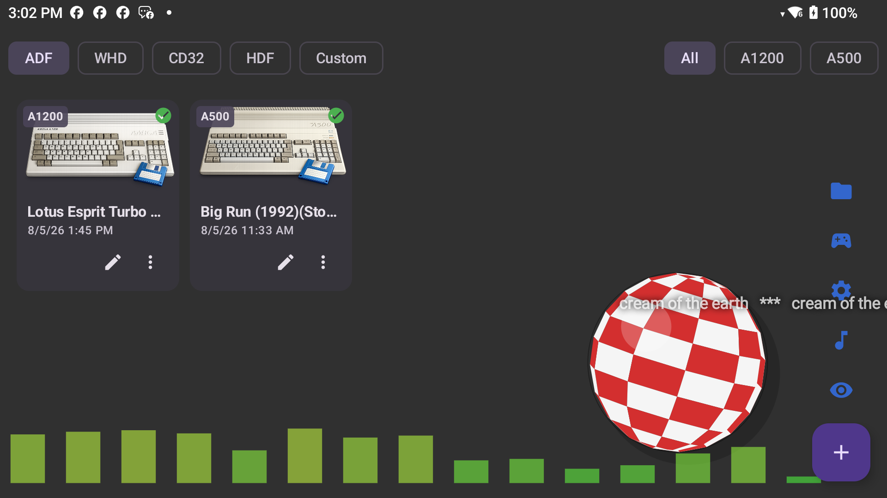
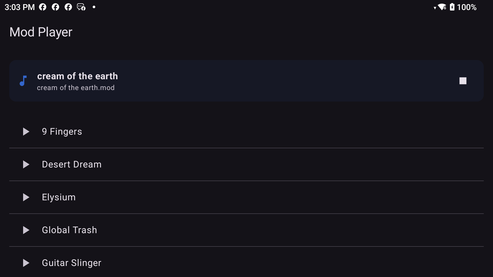
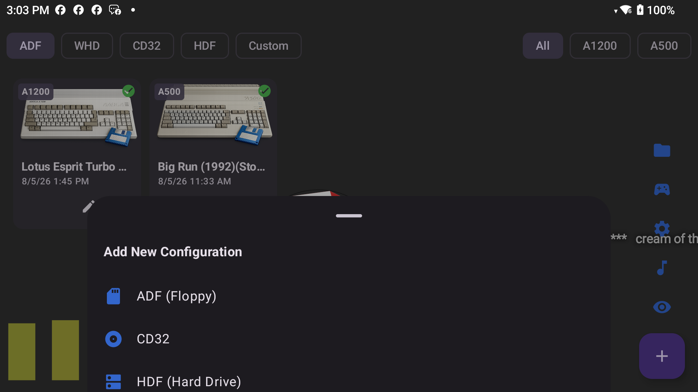

# UAE4ARM 2026

### Your Amiga. In your pocket. With the Boing ball bouncing behind it.

*Powered by Amiberry*

---

Remember loading a game off a floppy, listening to the drive chatter, and waiting for that
title screen to fade in? **UAE4ARM 2026** brings all of that back — the Amiga 500 under the
telly, the A1200 you saved up for, the CD32 you always wanted — and puts it on your Android
phone or handheld.

No config files. No fiddling. Pick a machine, pick a disk, hit play.

---

## What it looks like

| | |
|:---:|:---:|
|  |  |
| **A proper demoscene boot intro** — copper bars, morphing vectors and a sine scroller | **Your game shelf** — every saved setup as a card, tap to play |
|  |  |
| **Built-in mod player** — classic tracker tunes, always in the background | **Guided setup** — pick a type, follow the steps, done |

---

## The good stuff

🕹️ **Every Amiga worth having** — A500, A500+, A600, A1000, A2000, A1200, A3000, A4000,
CD32 and CDTV. All the machines Amiberry knows, none of the guesswork.

💾 **Floppies, hard drives, CDs and WHDLoad** — ADF, HDF, CD images, WHDLoad archives and
AGS collections. Drop the file in, the wizard works out the rest.

🎮 **Controls that just work** — plug in a gamepad, use the touchscreen joystick, or the
on-screen CD32 pad with all seven buttons. Change your controller once and every saved game
picks it up.

🎵 **A real mod player** — genuine ProTracker modules from the Amiga demoscene playing while
you browse, complete with a scroller crediting the tune. Because of course.

🔴⚪ **The Boing ball** — bouncing around behind your games, rolling in whatever direction
it's travelling, with a graphic equaliser pulsing along to the music. Poke it. It bounces.

⚡ **Fast where it counts** — ARM64 native, tuned so the audio stays clean and the frames
keep coming on modest hardware.

---

## Getting started

1. **Install the app.**
2. **Add a Kickstart ROM.** This is the Amiga's firmware — you'll need to supply your own
   (Cloanto's *Amiga Forever* is the usual legitimate route). Import it from the Files screen.
3. **Tap `+`**, choose what you're loading — a floppy, a hard drive, a CD32 game — and follow
   the wizard.
4. **Tap the card. Play.**

Everything you save turns up on the shelf, sorted by type and machine.

---

## While a game is running

- **Three-finger tap** or the **pause icon** brings up the overlay
- **Swap disks** without leaving the game
- **Edit the setup** and reboot straight back into it
- **Back** always returns you to your game — never dumps you out to the phone's home screen

---

## A note on ROMs and games

UAE4ARM 2026 ships **no copyrighted Amiga software**. No Kickstart ROMs, no games, no disk
images. You bring your own — from *Amiga Forever*, from your own floppies, or from the many
titles their authors have since released freely.

The mod music bundled with the app is **demoscene work**, included as a nod to the scene that
made the Amiga what it was.

---

## Credits

Built on **[Amiberry](https://amiberry.eu)**, the ARM-focused Amiga emulator, which in turn
descends from **UAE/WinUAE** by Bernd Schmidt, Toni Wilén and a long list of contributors who
have kept the Amiga alive for over thirty years.

Music from **[The Mod Archive](https://modarchive.org)**. AGS by Paul Vince. SDL by Sam
Lantinga and contributors. The original UAE4ARM project is by Chips (Georgiou Konstantinos).

Licensed under the [GNU General Public License v3.0](LICENSE).

And to everyone still writing demos, still making music in trackers, still keeping the scene
going — this one's for you.

*Only Amiga makes it possible.*

